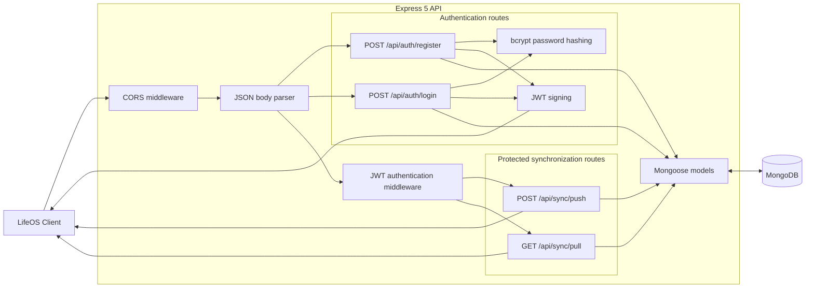

# LifeOS Sync Server

The LifeOS Sync Server provides account authentication and MongoDB-backed sync
for the separate LifeOS browser client. It is an Express 5 API using JWT bearer
tokens and Mongoose models.

This directory is an independent Git repository. The user interface lives in
the sibling `client` repository and must be configured and run separately.

## Responsibilities

- Register users and hash passwords with bcrypt
- Authenticate users and issue JWTs
- Accept client-side changes and upsert them by user and client record ID
- Return records updated since a supplied timestamp
- Restrict browser requests to configured frontend origins

## Architecture



Authentication routes are public. Sync routes pass through the JWT guard, which
sets the authenticated user ID used to scope every MongoDB query and upsert.

## Requirements

- Node.js 18 or newer
- npm
- MongoDB, either local or hosted

## Local setup

1. Install dependencies:

   ```bash
   npm install
   ```

2. Copy the environment template:

   ```bash
   cp .env.example .env
   ```

3. Set at least `MONGODB_URI` and a strong `JWT_SECRET` in `.env`.

4. Start the API:

   ```bash
   npm run dev
   ```

5. Configure the client with `VITE_API_URL=http://localhost:3001`.

The server listens on `http://localhost:3001` by default. Its default CORS
allowlist includes `http://localhost:5173` and `http://localhost:4173` when
`FRONTEND_URL` is not set.

## Environment variables

| Variable | Required | Description |
| --- | --- | --- |
| `MONGODB_URI` | Production | MongoDB connection URI; defaults to `mongodb://localhost:27017/lifetrack` |
| `JWT_SECRET` | Production | Secret used to sign and verify JWTs; the process exits if absent in production |
| `FRONTEND_URL` | No | Comma-separated exact origins allowed by CORS |
| `NODE_ENV` | No | Set to `production` to enforce a configured JWT secret |
| `PORT` | No | HTTP port; defaults to `3001` |

Generate a production JWT secret with a cryptographically secure tool, for
example `openssl rand -hex 64`. Never commit `.env`.

## Commands

| Command | Purpose |
| --- | --- |
| `npm start` | Start the server with Node.js |
| `npm run dev` | Start with Node.js watch mode |

The package contains a placeholder `test` script; there is currently no
automated test suite.

## API

All request and response bodies are JSON. Sync routes require this header:

```http
Authorization: Bearer <token>
```

### `POST /api/auth/register`

Creates an account and returns a token.

```json
{
  "email": "person@example.com",
  "password": "a-strong-password"
}
```

Successful response:

```json
{
  "token": "<jwt>",
  "userId": "<mongo-object-id>"
}
```

### `POST /api/auth/login`

Accepts the same body and returns the same response shape. Invalid credentials
return `401`.

### `POST /api/sync/push`

Upserts records by the authenticated `userId` and the client's numeric `id`.
The server stores that local ID as `clientId`.

```json
{
  "changes": {
    "foodLogs": [],
    "categories": [],
    "transactions": [],
    "activityLogs": [],
    "sleepLogs": []
  }
}
```

Successful response: `{ "success": true }`.

### `GET /api/sync/pull?lastSync=<ISO-8601 timestamp>`

Returns records whose `updatedAt` value is later than `lastSync`. If omitted,
the timestamp defaults to the Unix epoch.

```json
{
  "changes": {
    "foodLogs": [],
    "categories": [],
    "transactions": [],
    "activityLogs": [],
    "sleepLogs": []
  },
  "timestamp": "2026-01-01T12:00:00.000Z"
}
```

MongoDB-only fields are removed and `clientId` is returned as `id`.

## Data model and sync behavior

`models.js` defines `User`, `FoodLog`, `Category`, `Transaction`, `ActivityLog`,
and `SleepLog`. Each synchronized record belongs to a user and carries its
client-generated numeric ID. Pushes are processed one item at a time and are
upserts, making repeated writes for the same `(userId, clientId)` logically
idempotent.

The API does not currently expose hydration, budgets, timers, settings, or food
cache. It also has no delete endpoint; the schemas include a `deleted` flag,
but the client does not currently send tombstones when a local row is removed.

## Known compatibility gaps

The checked-in client and server schemas are not fully aligned:

- Client food rows use `foodName`, `mealType`, `carbs`, `fat`, and other macro
  fields; the server requires `name` and `time` and does not define most of
  those client fields.
- Client categories use `icon` and `isDefault`; the server requires `emoji` and
  uses a different optional `budget` field.
- Client timestamps are strings. Pull filtering therefore depends on consistent
  ISO-8601 values rather than MongoDB date fields.
- The schemas do not define a unique compound index on `(userId, clientId)`, so
  concurrent first-time upserts are not protected by a database constraint.

Align and migrate both repositories' models before relying on cross-device sync
in production.

## Production notes

- Set `NODE_ENV=production`, `JWT_SECRET`, `MONGODB_URI`, and the exact deployed
  client origin in `FRONTEND_URL`.
- Multiple frontend origins may be comma-separated, with no path component.
- Run behind HTTPS and a production process manager or hosting platform.
- Add request validation, rate limiting, token expiry/refresh, structured error
  handling, and automated tests before exposing the API publicly.
- Avoid logging credentials, tokens, or MongoDB connection strings.
